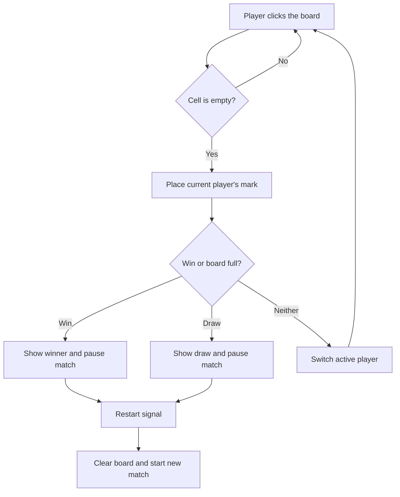

<div align="center">

# Tic Tac Toe

**A lightweight local two-player game that turns a familiar paper-and-pencil pastime into a quick desktop match.**

[](https://godotengine.org/)
[](https://godotengine.org/)
[](https://docs.godotengine.org/en/stable/tutorials/scripting/gdscript/index.html)
[](LICENSE)

</div>

---

<p align="center">
	
</p>

---

## Problem & Motivation

A quick game of tic-tac-toe should not require paper, setup, or an online account. This project brings the game to a small desktop window while keeping both players on the same device and the rules easy to follow.

**Tic Tac Toe** keeps a match focused on the board:

- **Starts quickly:** Launch the project directly in Godot, with no external services or dependencies.
- **Keeps play local:** Two players take turns on the same board without accounts or network access.
- **Resolves matches clearly:** Winning lines and full-board draws end the round, with a restart option for another game.

---

## Key Features

- **Validates** mouse clicks so marks can only be placed in empty board cells.
- **Alternates** circle and cross turns and shows which mark is next.
- **Detects** row, column, and diagonal wins, as well as draws when the board fills.
- **Restarts** a completed match from the game-over menu.

---

## Architecture & How It Works



`Main.gd` owns the board state, turn changes, and win/draw checks. The board, circle, cross, and game-over menu are separate Godot scenes; the menu emits a restart signal handled by the main scene.

## Tech Stack

| Category | Technology | Purpose |
| --- | --- | --- |
| Engine | Godot 4.7 | Scene management, input, rendering, and desktop game runtime |
| Language | GDScript | Board state, turn logic, and win/draw detection |
| Architecture | Scene composition and signals | Separates the board, markers, and game-over menu |
| Rendering | GL Compatibility | Broad desktop graphics compatibility |
| Target | Windows Desktop | Configured export preset for 64-bit Windows |

## Project Structure

```text
assets/   Textures, application icon, and Godot import settings
scenes/   Main game, board, marker, and game-over scenes
scripts/  Game logic and its game-over menu script
```

## Getting Started

### Prerequisites

- **Godot Engine 4.7**, with matching export templates if you plan to export a build.
- **Git** to clone the repository, or download the repository ZIP from GitHub.

### 1. Get the project

```bash
git clone https://github.com/coxteen/tic-tac-toe.git
cd tic-tac-toe
```

### 2. Run locally

1. Open Godot and import the folder containing `project.godot`.
2. Open the project and press **F5** to run the project’s configured main scene.
3. Click an empty cell to place your mark. Players alternate on the same computer.
4. Select **Restart** after a win or draw to play again.

No package installation, environment file, credentials, or network connection is needed.

### Export for Windows

The project includes a Windows Desktop export preset. In Godot, install the matching export templates, then choose **Project > Export**, select **Tic Tac Toe**, and export the project.

## Configuration

The main scene and initial window size are set in `project.godot`. The current window is 900 × 600 pixels; the game has no external configuration or secret values.

## License & Author

- **Author:** [Costin Ghiujan](https://github.com/coxteen)
- **License:** Released under the [MIT License](LICENSE)
